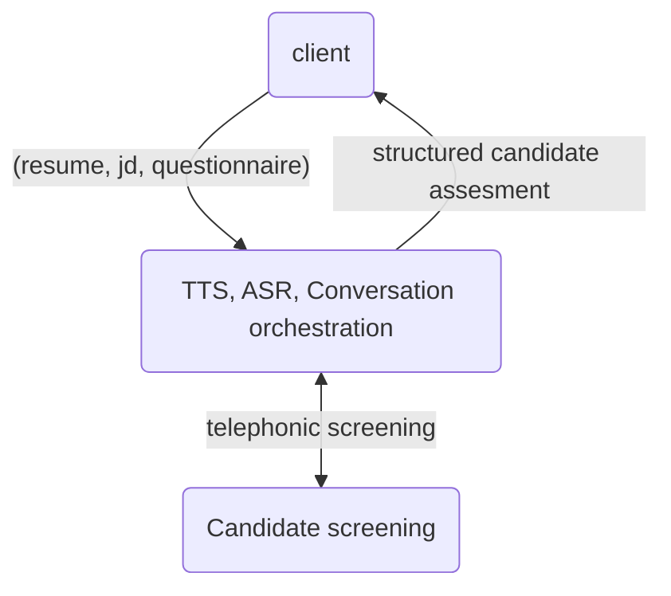

# 🚀 Origa

 

> [!NOTE]⚡️
> The Origa API provides a comprehensive suite of endpoints to seamlessly integrate AI-driven candidate assessment capabilities into your existing workflows or systems. Leveraging advanced natural language processing and machine learning techniques, our API empowers you to integrate Origa's cutting-edge voice AI to automate recruiter screening through high-quality, AI-driven conversations.

## Architecture Overview

The Origa API is built on a robust microservices architecture, ensuring high scalability, reliability, and performance. Our RESTful API design adheres to industry best practices, providing a secure and intuitive interface for programmatic interaction.

Key architectural components:

-   API Gateway: Handles request routing, authentication, and rate limiting
-   Orchestration Layer: Coordinates the execution of various AI models and services
-   NLP Modules: Perform natural language understanding, sentiment analysis, and entity extraction
-   Machine Learning Models: Conduct candidate assessment, skill matching, and interview scheduling optimization
-   Data Persistence: Utilizes distributed databases and caches for efficient storage and retrieval

## API Workflow

The Origa API follows the following workflow:

The client sends the candidate's resume, job description (JD), and questionnaire to the Origa API.

-   The Origa API uses Text-to-Speech (TTS), Automatic Speech Recognition (ASR), and Conversation Orchestration models to conduct the telephonic screening with the candidate.
-   The candidate undergoes the screening process, and their responses are captured.
-   The Origa API performs a structured candidate assessment based on the screening results.
-   The structured candidate assessment is sent back to the client for further evaluation and decision-making.